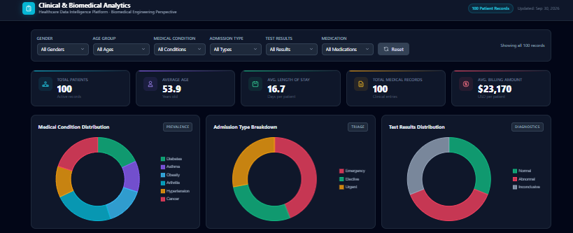
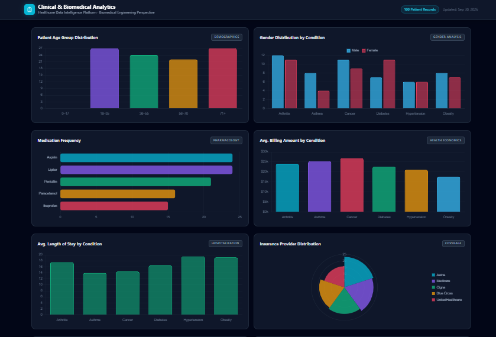
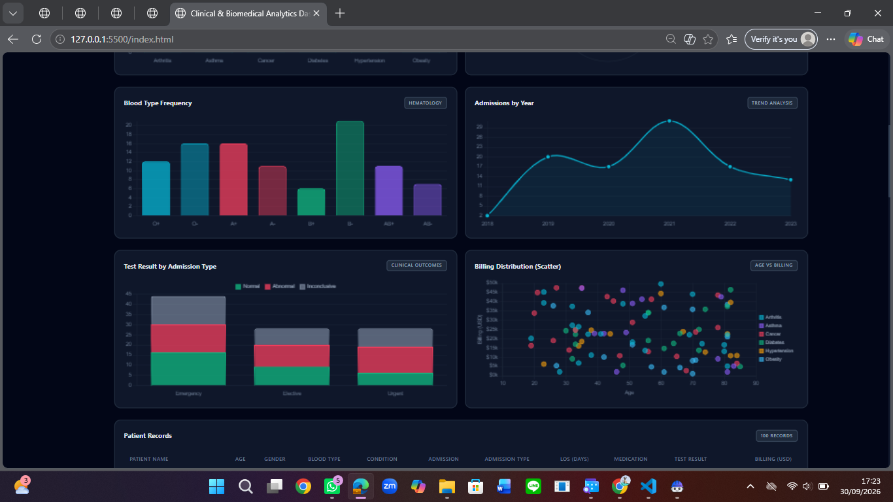
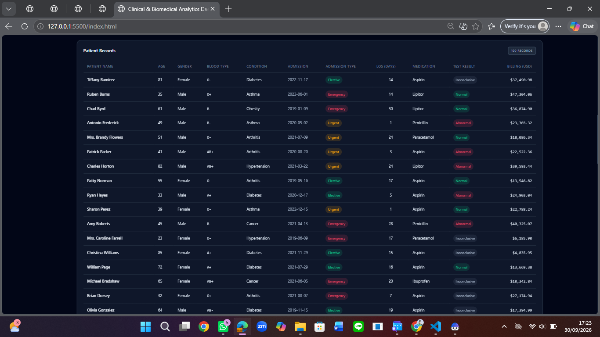

<div align="center">

# Clinical & Biomedical Analytics Dashboard

**From patient records to patterns you can actually see.**

An interactive healthcare analytics dashboard built with **HTML, CSS, vanilla JavaScript, and Chart.js**, featuring **13 interactive charts, 6 live filters, KPI cards, and a patient records table.**


</div>

---

## Project Preview

### Overview


### Charts



### Patient Records


*Showing the first rows of the 100 patient records.*

---

## About the Project

I built this dashboard as my capstone project for **IBM SkillsBuild University Education**, a program run by IBM and Hacktiv8 that focuses on practical AI skills. My goal was simple: **turn a patient dataset into something that is easy to explore and understand.**

Rather than creating a few static charts, I wanted the dashboard to behave like an actual analytics interface. Users can apply filters and see the KPIs, charts, and patient table update instantly.

The dashboard explores 100 patient records and answers questions such as:

* Which medical conditions appear most frequently?
* How are admissions distributed across different admission types?
* How does billing vary between medical conditions?
* What does the length of stay look like across patient groups?
* How are age, gender, test results, and other variables distributed?

**Change a filter, and the dashboard responds.**

## Features

| Feature                   | Description                                                                            |
| ------------------------- | -------------------------------------------------------------------------------------- |
| **6 live filters**        | Gender, age group, medical condition, admission type, test results, and medication     |
| **5 KPI cards**           | Patient count, average age, average length of stay, total records, and average billing |
| **13 interactive charts** | Donut, bar, stacked bar, horizontal bar, polar area, line, and scatter charts          |
| **Patient records table** | Browse individual records with visual indicators for admission type and test results   |
| **Dark theme**            | Clean interface designed for comfortable data exploration                              |
| **One-click reset**       | Clear all filters and return to the full dataset                                       |

## What's Inside

<details>
<summary><b>13 Charts</b></summary>

<br>

1. Medical condition distribution
2. Admission type breakdown
3. Test results distribution
4. Patient age group distribution
5. Gender distribution by condition
6. Medication frequency
7. Average billing amount by condition
8. Average length of stay by condition
9. Insurance provider distribution
10. Blood type frequency
11. Admissions by year
12. Test results by admission type
13. Billing distribution: age vs. billing

</details>

## How It Works

The dashboard is built without a frontend framework.

* **HTML5**: dashboard structure and components
* **CSS3**: layout, styling, and dark theme
* **Vanilla JavaScript**: data loading, filtering, calculations, DOM updates, and chart rendering
* **Chart.js**: interactive data visualization
* **JSON**: structured patient dataset
* **Inter**: interface typography

The main workflow is:

**Load data → apply filters → recalculate metrics → update KPIs, charts, and table.**

## AI-Assisted Development

This project was developed with the help of **IBM Bob**, an AI-powered coding assistant, as part of the IBM SkillsBuild University Education program. I used it to speed up development and explore ideas, then reviewed, tested, and adjusted the result to make sure I understood how the dashboard works.

## Run Locally

The dashboard loads `healthcare_data.json` using `fetch()`, so opening `index.html` directly as a local file will not work in most browsers.

You can run it using a local server.

### Option 1: VS Code Live Server

1. Install the **Live Server** extension.
2. Open the project folder in VS Code.
3. Right-click `index.html`.
4. Select **Open with Live Server**.

### Option 2: Python

```bash
python -m http.server 5500
```

Then open:

```text
http://127.0.0.1:5500/index.html
```

## Project Structure

```text
├── index.html            # Dashboard structure
├── script.js             # Data loading, filtering, KPIs, and charts
├── style.css             # Dashboard styling
├── healthcare_data.json  # 100 synthetic patient records
├── screenshots/          # Project preview images
└── README.md
```

## About the Data

The dashboard uses the [Healthcare Dataset]([YOUR-KAGGLE-LINK](https://www.kaggle.com/datasets/prasad22/healthcare-dataset) from Kaggle, released under the **CC0: Public Domain** license.

The dataset contains **synthetic patient records generated with Python's Faker library**, so the records do not represent real patients.

For this project, I converted the original CSV into JSON and worked with **100 records** to keep the dashboard lightweight and easy to explore.

> **Note:** Because the data is synthetic and the sample is limited, the patterns shown here should not be interpreted as real clinical findings or medical evidence. This project is intended for data analysis and visualization practice.

## What I Learned

This project helped me practice the full process of turning structured data into an interactive analytics interface.

I worked on:

* Loading and transforming JSON data with vanilla JavaScript
* Building dynamic filters that affect multiple visualizations
* Calculating KPIs from filtered records
* Choosing chart types based on the question being explored
* Updating charts and UI components from a shared filter state
* Structuring a small frontend project without a framework
* Balancing data density with readability when designing a dashboard

One of my main takeaways was that **good data visualization is not just about making charts look good. It's about making the information easier to understand and explore.**

## Future Improvements

* [ ] Export filtered records to CSV
* [ ] Add patient search and table sorting
* [ ] Add a light/dark theme toggle
* [ ] Support the full dataset with pagination
* [ ] Add more advanced analytics and derived metrics

## About Me

I'm **Aurelia Ardhanisa Putri**, a Biomedical Engineering graduate interested in **data, AI, and healthcare technology**.

I enjoy working with data, building visualizations, and exploring how technology can turn complex information into something more useful and understandable.

This dashboard was completed as a capstone project for the IBM SkillsBuild University Education program in collaboration with Hacktiv8, and it is part of my growing portfolio in **data analytics, machine learning, and intelligent healthcare systems**.
